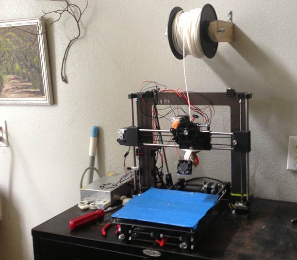

# Dan's Prusa i3 Variant

I use this repository to store all the information I need on my 3D printer, an aluminum [Prusa i3](http://reprap.org/wiki/Prusa_i3), modified from a kit sold by *XS's Ink*, that I bought off Craigslist from a guy who had gave up at getting it working.



 - Model files to print the physical body.
 - Firmware files for flashing an Arduino (in my case, a [Sanguinololu 1.3a](https://github.com/mosfet/Sanguinololu/tree/master/rev1.3a))
 - Calibration files for use with [Slic3r](http://slic3r.org/).
 - Eventually I hope to add details on my OctoPrint server, maybe a Chef recipe. For now I have an SD image I clone, which is a bit bloated for version control.

## Physical Information

Size: 200mm cubed
Type: Aluminum framed body
Belt type: GT2 (2mm toothed robotics belt).
Extruder:  [Greg's Wade Extruder](http://www.thingiverse.com/thing:65939).
Nozzle: 0.5mm [Budaschnozzle 2.0](https://www.lulzbot.com/support/budaschnozzle-20) with 1.75mm PTFE tube modification for printing 1.75mm filament (I use PLA).
Bed leveling system: 3-point leveling, generally adjusted during the skirt-printing that occurs before every print when using the included Slic3r calibration bundle.

## Beware below!

Below is a pasted and only minorly cleaned up text file that I used to keep notes while I was originally calibrating the machine.

## Notes

serial frequency: 115200

micro step = 16x
full steps per revolution = 200
*This seems to be outdated, I use GT2 belts now:*
T5 belt (5mm) : http://www.sdp-si.com/D265/PDF/D265P1032.pdf
12 teeth on x & y motor gears

XY STEPS: 53

Z axis: M5 threaded rod (0.80 pitch).

Z STEPS: 4000
(un-micro-stepped gives us 0.08mm per step, the safest increment)
Set current z to 0: G92 Z0

### Valid layer height options
```javascript
for (var i = 0.2; i < 0.4; i+=0.08) { console.log(i); }
```
0.2
0.28
0.36
0.44

### Wade's Geared Extruder details:

hob diameter: 7.25mm
small gear teeth: 10
big gear teeth: 43

E STEPS: 605

Uses an 608 bearing on a M8x20 grub screw

Initial default line width: 0.85
Actual average fill width:  0.71+0.78+0.75 =AVERAGE=

theoretical/measured = 1.1333, then 1.25, now trying 1.5 just to try something crazy.  First 3 all gave around 0.75mm average, 1.5 gave around .93

Asked to extrude 30mm, instead extruded 26.56mm

Previous E Steps: 605
Number of steps tested: 605*30=18150
New E Steps: 18150/26.56mm = 683.3584337349398


Y axis was printing a bit small.  Printed a 25x25mm thing, y axis only gave 23.67, so I changed y steps per unit to 56.33, an increase of about 5%.

M303 E-0 C10 S190

## PID Calibrations

### Original J-Head Nozzle PID Calibration:
####With fan:
```C
  #define  DEFAULT_Kp 22.2
  #define  DEFAULT_Ki 1.08
  #define  DEFAULT_Kd 114
```

### Budaschnozzle 2.0 PID Calibration:
####Without fan:
 - Kp: 32.33
 - Ki: 1.55
 - Kd: 168.97
 
